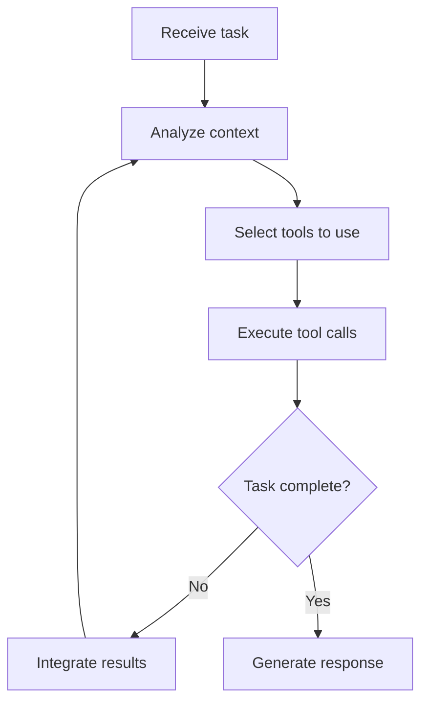

## What are agents?

Agents are the core execution units in Jazz. Each agent is an autonomous AI assistant with its own configuration, tools, and behavior. Think of an agent as a specialized AI worker with a specific role and set of capabilities.

When you run `jazz`, you're starting a conversation with an agent. That agent uses its configured LLM provider, tools, and persona to understand your request and execute tasks autonomously.

## Agent anatomy

Every agent consists of:

- **Name and description**: Human-friendly identifier and purpose
- **LLM configuration**: Which model provider and model to use
- **Tool access**: Which tools the agent can use (filesystem, git, web search, etc.)
- **Persona**: The agent's behavior and expertise (general assistant, code reviewer, researcher, etc.)
- **Working directory**: Where the agent operates by default

## Creating an agent

Create a new agent interactively:

```bash
jazz agent create
```

You'll be prompted for:

- **Agent name**: A unique identifier (e.g., `my-dev-agent`)
- **Description**: What the agent does (e.g., "Helps with backend development")
- **LLM provider**: OpenAI, Anthropic, Google, OpenRouter, etc.
- **Model**: The specific model to use
- **Tools**: Which capabilities to enable

<Tip>
Start with a general-purpose agent first, then create specialized agents for specific workflows as needed.
</Tip>

## Agent configuration

Agents are stored as JSON files in `~/.jazz/agents/`. Here's an example configuration:

```json
{
  "id": "abc123",
  "name": "dev-agent",
  "description": "Development assistant for TypeScript projects",
  "config": {
    "llmProvider": "anthropic",
    "llmModel": "claude-3-5-sonnet-20241022",
    "tools": ["all"],
    "persona": "general",
    "workingDirectory": "~/projects/my-app",
    "reasoningEffort": "medium"
  },
  "createdAt": "2026-03-03T10:00:00Z",
  "updatedAt": "2026-03-03T10:00:00Z"
}
```

### Configuration options

<AccordionGroup>
  <Accordion title="llmProvider">
    The AI provider to use. Options include:
    - `anthropic` - Claude models
    - `openai` - GPT models
    - `google` - Gemini models  
    - `openrouter` - Access to 100+ models
    - `ollama` - Local models
    - And more (see [Providers](/core/providers))
  </Accordion>

  <Accordion title="llmModel">
    The specific model identifier. Examples:
    - `claude-3-5-sonnet-20241022`
    - `gpt-4o`
    - `gemini-2.0-flash-exp`
    - `deepseek/deepseek-chat`
  </Accordion>

  <Accordion title="tools">
    Which tools the agent can access:
    - `["all"]` - All available tools
    - `["fs-read", "fs-write", "git"]` - Specific tools
    - Tool categories: `filesystem`, `git`, `web`, `shell`, etc.

    See [Tools](/core/tools) for the complete list.
  </Accordion>

  <Accordion title="persona">
    The agent's behavior and expertise:
    - `general` - Versatile assistant (default)
    - `summarizer` - Optimized for summarization
    - Custom personas from `~/.jazz/personas/`

    See [Personas](/advanced/personas) for creating custom personas.
  </Accordion>

  <Accordion title="reasoningEffort">
    How much the model should "think" before responding:
    - `disable` - Standard mode
    - `low` - Quick reasoning
    - `medium` - Balanced reasoning  
    - `high` - Deep reasoning

    Only supported by certain models (e.g., OpenAI o1, o3).
  </Accordion>
</AccordionGroup>

## How agents work

When you give an agent a task, here's what happens:

### 1. Context building

The agent builds context from:
- Your input message
- Conversation history
- Available tools and their descriptions
- Skills that can be loaded
- The agent's persona instructions

### 2. Execution loop

The agent enters an autonomous loop:



### 3. Tool execution

When the agent calls tools:
- **Read-only tools** (reading files, searching) execute automatically
- **Modifying tools** (writing files, git commits) require approval
- **Shell commands** require approval unless auto-approved

See [Auto-approval policies](/core/approval) for fine-grained control.

### 4. Sub-agents

Agents can spawn sub-agents for specialized tasks:

```typescript
// From agent-runner.ts:326-344
public static summarizeHistory(
  messagesToSummarize: ChatMessage[],
  agent: Agent,
  sessionId: string,
  conversationId: string,
): Effect.Effect<ChatMessage, Error, Dependencies> {
  // Spawns a specialized summarizer sub-agent
  return Summarizer.summarizeHistory(
    messagesToSummarize,
    agent,
    sessionId,
    conversationId,
    runRecursive,
  );
}
```

Sub-agents:
- Inherit the parent agent's configuration
- Run without UI interruptions (no thinking indicators)
- Return results to the parent agent
- Are used for summarization, research, and other specialized tasks

## Agent service API

The agent service provides programmatic access to agent management:

```typescript
// Create an agent
const agent = yield* createAgent(
  "research-agent",
  "Conducts deep research with citations",
  {
    llmProvider: "anthropic",
    llmModel: "claude-3-5-sonnet-20241022",
    tools: ["web-search", "http-request"],
    persona: "general",
  }
);

// Get agent by ID or name
const agent = yield* getAgentByIdentifier("research-agent");

// List all agents
const agents = yield* listAllAgents();
```

<Info>
The agent service uses [Effect-TS](https://effect.website/) for type-safe error handling and dependency injection.
</Info>

## Running agents

### Interactive chat

```bash
# Start with agent selection
jazz

# Chat with a specific agent
jazz agent chat my-agent
```

### One-off commands

```bash
# Execute a single task
jazz "analyze the git history and find the commit that introduced the bug"
```

### In workflows

Agents can run unattended in workflows:

```yaml
---
name: daily-standup
schedule: "0 9 * * 1-5"
agent: dev-agent
autoApprove: read-only
---

Check my git activity from yesterday and summarize what I worked on.
```

See [Workflows](/concepts/workflows) for more details.

## Agent iteration limits

Agents have a maximum iteration count to prevent infinite loops:

- **Default**: 50 iterations
- **Configurable**: Set `maxIterations` in workflow frontmatter or via API
- **What counts**: Each LLM call + tool execution cycle is one iteration

```yaml
---
maxIterations: 100
---
```

<Warning>
If an agent hits the iteration limit, it will stop and report what it accomplished so far. Consider breaking complex tasks into smaller workflows.
</Warning>

## Context window management

Agents automatically manage their context window:

1. **Track token usage**: Monitor input and output tokens
2. **Detect overflow**: When approaching the model's limit
3. **Summarize history**: Use a summarizer sub-agent to condense old messages
4. **Continue execution**: Resume with the condensed history

This happens transparently—you don't need to manage it manually.

## Best practices

### Specialized agents

Create agents for specific roles:

```bash
# Code review agent
jazz agent create code-reviewer
# Configure with: gpt-4o, filesystem + git tools, code-review skill

# Research agent  
jazz agent create researcher
# Configure with: claude-sonnet, web-search + http-request tools

# Writing agent
jazz agent create writer
# Configure with: gemini-2.0-flash, filesystem tools only
```

### Tool selection

Give agents only the tools they need:

- **Research agents**: `web-search`, `http-request`
- **Code agents**: `filesystem`, `git`, `shell`
- **Writing agents**: `filesystem` (read/write)
- **Review agents**: `filesystem` (read-only), `git`

<Tip>
Fewer tools = faster execution and lower costs. The agent spends less time deciding which tools to use.
</Tip>

### Model selection

- **Complex reasoning**: `claude-3-5-sonnet`, `gpt-4o`, `gemini-2.0-flash-thinking-exp`
- **Fast tasks**: `claude-3-5-haiku`, `gpt-4o-mini`, `gemini-2.0-flash`  
- **Long context**: `gemini-2.0-flash-exp` (1M tokens), `claude-3-5-sonnet` (200K)
- **Cost-effective**: `deepseek-chat`, OpenRouter free models

## Next steps

<CardGroup cols={2}>
  <Card title="Skills" icon="puzzle-piece" href="/concepts/skills">
    Load specialized expertise into your agents
  </Card>
  <Card title="Workflows" icon="repeat" href="/concepts/workflows">
    Automate agents with scheduled workflows
  </Card>
  <Card title="Tools" icon="wrench" href="/core/tools">
    Explore all available agent tools
  </Card>
  <Card title="MCP" icon="plug" href="/concepts/mcp">
    Connect agents to external services
  </Card>
</CardGroup>